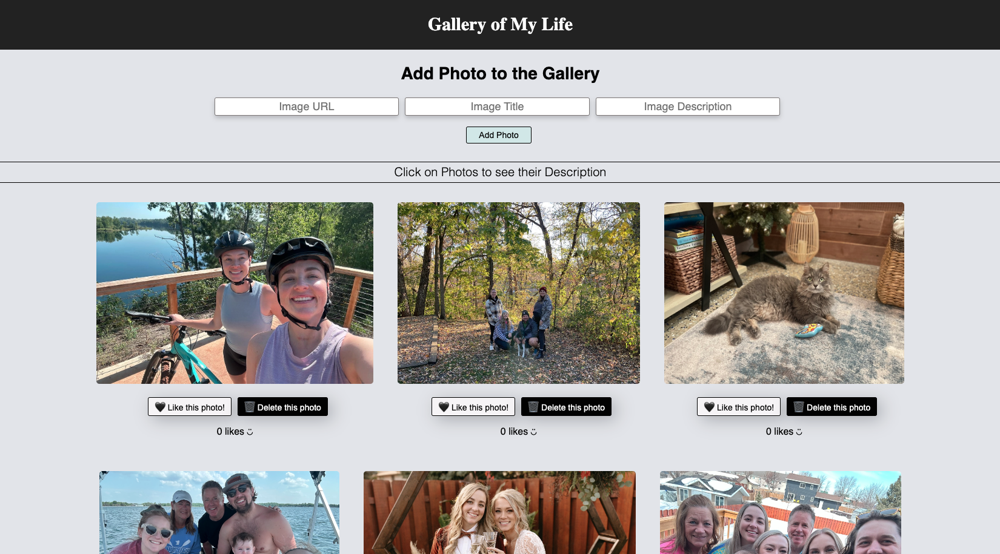

# React - Gallery of My Life

Link to software that is required to install the app (e.g. node).

- [Node.js](https://nodejs.org/en/)
- [PostgreSQL](https://www.postgresql.org)

## Database:
- Please reference the databse.sql file to create a new database 
- [Postico] recommended to setup table (https://eggerapps.at/postico/) 
- Create database called 'react_gallery' 

## Installation

1. Clone Repository
4. Run 'npm install'
5. Run 'npm run server'
6. Run 'npm run client' - you will need multiple terminals open for this
7. App should open in your browser

Running the server code requires `nodemon`. If you don't already have `nodemon`, install it globally with `npm install nodemon --global`.

## Description

In this project I have created a gallery page to share pictures of things that are important to me. 

In this project I used 4 components:

- `App` - represents the overall application or site 
- `GalleryList` - represents the gallery of images
- `GalleryItem` - represents a single image in the gallery with the ability to click the image to toggle between image and description as well as the ability to like an image.
- `Add Form` - represents the form to add additional images via url, title, and description inputs.

## Usage

1. If database is setup and the app is running in browser you may start adding photos with the inputs provided
3. Add as many photos as you would like, as well as titles and descriptions of the images you are adding. Image urls and descriptions are required because they will be shown but titles are not required.
4. Use the "like" button to increase the amount of likes on each photo.
5. Use the Delete button associated with each photo to remove from the app and database (cannot be undone).
6. Click on a photo to have the photo's description displayed and then re-click the description to have to photo re-displayed.

## Wireframe

### Built With

 - HTML
 - CSS
 - Javascript
 - React.js
 - PG
 - Express.js
 - PostgresSQL
 - Postico
 - Postman
 - Git
 - GitHub
 - VScode
 - Nodemon (for development)

### Acknowledgement

Thanks to [Emerging Digital Academy](http://www.emergingacademy.org) who equipped and helped me to make this application a reality. 

### Support

If you have suggestions or issues, please email me at [alyssa.s.nichols94@gmail.com](mailto:alyssa.s.nichols94@gmail.com)
